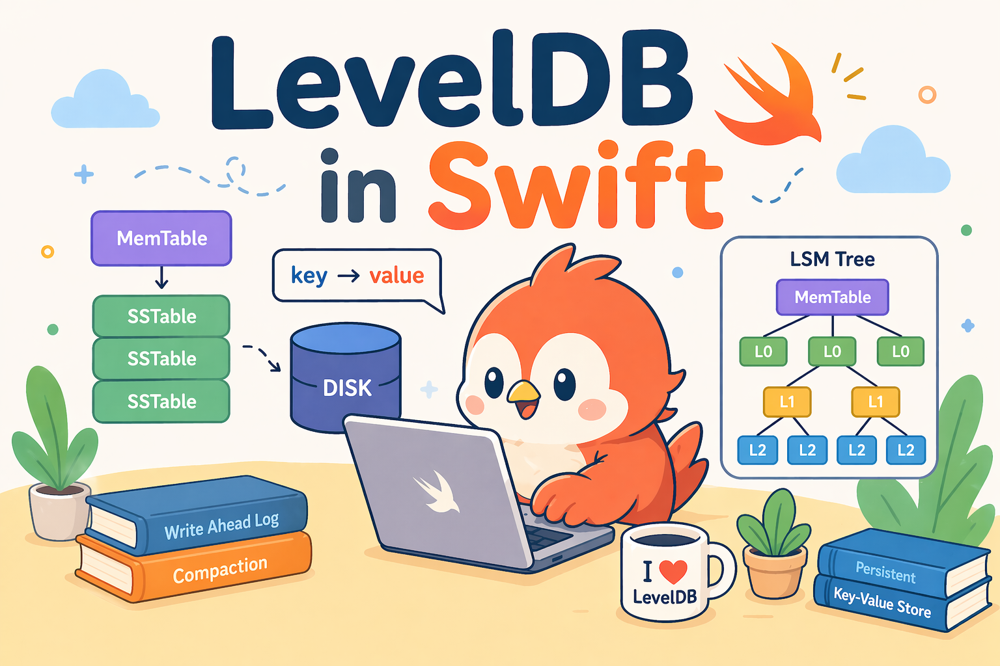

<h1>
  
  LevelDB in Swift
</h1>

---

This is a personal learning project where I rewrote Google's [LevelDB](https://github.com/google/leveldb/tree/main) in Swift.

***Still building the first production-ready version.***

The current implementation targets macOS only. It's a command-line program with no UI, built with Xcode.

